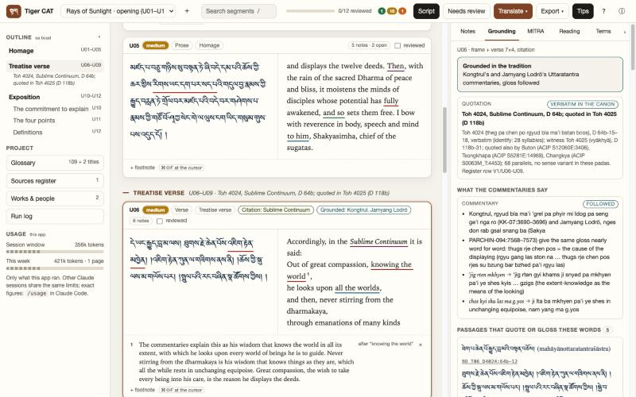

# Tibetan Translation Skills and Tiger CAT

Translate Classical Tibetan (Wylie or Tibetan script) into English with Claude Code, in a chat or
in a local app. Everything runs on your own computer under your own Claude account.

Two things live in this repository:

- **The skills** (`skills/`): four Claude Code skills. `tibetan-translate` is the entry point: a
  brief, the model's own reading and draft, a grounding pass that finds the canon's commentaries on
  the passage through Dharmamitra, a style pass for the audience, a check, and two streams of
  notes (footnotes for the reader, working notes for the editing translator). `tibetan-verse`
  (metred verse), `tibetan-citations` (short titles, sources register) and `tibetan-dharmamitra`
  (the Dharmamitra APIs and the MITRA second opinion) are its companions. You use them inside any
  Claude Code chat: paste the Tibetan and say "translate this with the skill".
- **Tiger CAT** (`cat/`): a local app for translating a whole text with the skill. Paste the
  Tibetan, set the brief, run the skill page by page, review every segment beside its Tibetan with
  the notes, the commentaries and the MITRA opinion, revise, and export a Word file with real
  footnotes. The app never calls a model or Dharmamitra itself: each page is a headless session of
  your own Claude Code with the installed skill.

The skills work without the app. The app needs the installed skills.



## Which guide is for you

- **New to Claude Code or the terminal?** Read [docs/getting-started.md](docs/getting-started.md).
  It spells out every step: installing Claude Code, running the installer, your first translation
  in a chat, and setting up and using Tiger CAT.
- **Know your way around?** Quick start below. Then [docs/skills.md](docs/skills.md) for the
  skills (the pipeline, the brief, the notes, the tools from the command line, model and effort,
  cost, how it was tested) and [cat/README.md](cat/README.md) for the app.

## Quick start

Requirements: macOS or Linux; Python 3.9+ (3.11 recommended), `git`, `curl`; Claude Code (the CLI
or the desktop app's Code tab in a local session: Cowork and cloud sessions do not read
`~/.claude/skills/`); Claude Opus or Fable at max effort for translation work; network for
Dharmamitra and the one-time lexicon download (~274 MB); about 1 GB of disk.

```bash
git clone https://github.com/gkoebler8-vjr/tibetan-translation-skills.git
```

```bash
cd tibetan-translation-skills
```

Skills only (a chat is all you need):

```bash
./install.sh
```

Skills and the app:

```bash
./install.sh --cat
```

| Flag | What it adds |
|---|---|
| none | the four skills into `~/.claude/skills/`, a venv at `~/.venvs/tib` (botok, pyewts), the MITRA Tibetan Lexicon, the dictionary index at `~/.tibdict/` |
| `--cat` | Tiger CAT: a venv at `~/.venvs/vcat` (python-docx, pyewts) and the launcher `cat/Tiger CAT.app` |
| `--skills-only` | the skills only (no venv, download or index); combine with `--cat` for skills and app without the dictionary |
| `--public` | also the open Tibetan-English dictionaries of Christian Steinert's project (~38 MB), indexed |
| `--golden DIR` | also a folder of your own StarDict dictionaries (`docs/own-dictionaries.md`) |
| `--help` | this list |

Idempotent; nothing is uploaded anywhere. Smoke tests:

```bash
python3 ~/.claude/skills/tibetan-translate/tools/tibdict.py annotate "བླ་མའི་བྱིན་རླབས་ཁོ་ན་ལས།"
```

```bash
python3 ~/.claude/skills/tibetan-translate/tools/dm.py identify "rnam rtog ma rig chen po ste / 'khor ba'i rgya mtshor ltung byed yin"
```

**Translate in a chat.** Open Claude Code in the folder of your text (the glossary and construal
files the skill keeps there are what hold terms consistent across a long text), set `/model opus`
and `/effort max`, paste the Tibetan and ask for a translation, or type `/tibetan-translate`. It
asks once for the audience, purpose, house style and notes policy, or reads them from a `CLAUDE.md`
in the folder. Everything else: [docs/skills.md](docs/skills.md).

**Translate in the app.** Double-click `cat/Tiger CAT.app`, or run
`python3 cat/tools/serve.py --port 8765` and open http://127.0.0.1:8765. Sign in once through
*Translate ▾ → Sign in to Claude Code*, make a project from pasted Tibetan, translate page by page,
review, export. On macOS, the first start of the .app asks for access to the folder the
repository is in (Desktop or Documents); allow it. Everything else: [cat/README.md](cat/README.md).

## What it adds, and what it does not

Measured in October 2026 on 33 pages that have published translations, then against the bare
model on three of them (`docs/Test_Report_2026-10-03.md`). Against Dharmamitra's MITRA alone the
pipeline on Opus made a tenth of the meaning errors. Against bare Opus given the same brief and no
skill it was **not more faithful**, and at max effort not better in English either. What the skill
adds is a fixed house style, verse that scans, fewer ambiguities resolved without a note, and the
working files a bare run does not produce: a construal of every sentence, a glossary that binds
terms across a long text, source identification with Toh numbers, footnotes from the commentaries,
and the MITRA flags. It costs about twice a bare run. Use it for a long text in a fixed style with a
glossary and references; for a bare translation of one page, the model at max effort is as faithful
and cheaper. Tiger CAT adds the workbench around that: segments, a brief that persists, page runs
that survive usage limits, review with the trail, and Word export. Full numbers and caveats:
[docs/skills.md](docs/skills.md#what-it-adds-and-what-it-does-not).

## Layout

```
README.md               this page
docs/getting-started.md step-by-step guide for translators new to Claude Code (chat and app)
docs/skills.md          the skills in full: pipeline, brief, notes, tools, model and effort, cost, tests
docs/                   Test_Report_2026-10-03.md, the overhaul report, own-dictionaries.md, research/ (Dharmamitra API notes)
skills/                 the four skills (source of truth; install.sh copies them to ~/.claude/skills)
  tibetan-translate/    SKILL.md + reference/ + tools/ (tibdict.py, dm.py, export_docx.py)
  tibetan-verse/        SKILL.md + reference/ + tools/ (beats.py, lexicon.py)
  tibetan-citations/    SKILL.md + tools/register.py
  tibetan-dharmamitra/  SKILL.md + reference/ + tools/ (mitra.py, setup_mitra.sh: optional local model)
cat/                    Tiger CAT: README.md, app/ (UI), tools/ (serve.py, build_data.py, tibseg.py, make_app.sh),
                        projects/ (a finished sample page and a try-it page), Tiger CAT.app, docs/
tests/                  campaign_2026-10-03/: 33 judged page runs and the bare-model baseline
resources/              downloaded dictionary data (gitignored)
install.sh  export.sh   setup; copy edited live skills back into the repo
LICENSE  LICENSE-NOTES.md
```

## Editing the skills

The repo is the source of truth; Claude Code and the app load the installed copy. Edit `skills/`,
then `./install.sh --skills-only`; or edit the live copies under `~/.claude/skills/` and run
`./export.sh` to copy them back. `install.sh` replaces each skill directory wholesale, so do one or
the other. After editing, `/reload-skills` in a running session. Tiger CAT's server says at start
if the installed skill is older than the repo's.

## Licences

Code (`skills/*/tools/`, `cat/app/`, `cat/tools/`, `install.sh`, `export.sh`, `tests/**/*.py`): MIT.
Text (SKILL.md and reference files, docs, READMEs, test reports): CC BY 4.0, attribution "Tibetan
Translation Skills by Gabriel Kobler, built with Claude (Anthropic)". Third-party data is not
bundled: the installer downloads the MITRA Tibetan Lexicon (Dharmamitra, CC BY-SA 4.0) and, on
request, open dictionaries whose copyright stays with their authors. An index built from your own or
the public dictionaries is private working data; do not redistribute it. Details in `LICENSE` and
`LICENSE-NOTES.md`.

## Credits

- **Dharmamitra** (Sebastian Nehrdich and colleagues): the MITRA Tibetan Lexicon, the search and
  parallels endpoints, and MITRA translation, used at personal-research rate and named at each
  stage where they are used.
- **84000**: translations and the glossary, used for citation lookup and as references.
- **Christian Steinert**: the open tibetan-dictionary project and its dictionary files; copyright
  of the dictionary data is with the respective authors (Hopkins, Rangjung Yeshe, Berzin, Valby,
  Ives Waldo and others).
- **Edition Garchen Stiftung translators**, whose published work was used as references in testing.
- botok and pyewts for segmentation and Wylie conversion; python-docx for the Word export.

Author: Gabriel Kobler. Built with Claude (Opus and Fable), September to October 2026. Questions
and problems: https://github.com/gkoebler8-vjr/tibetan-translation-skills/issues.
